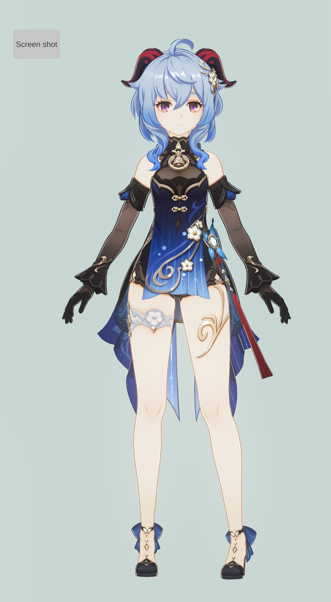
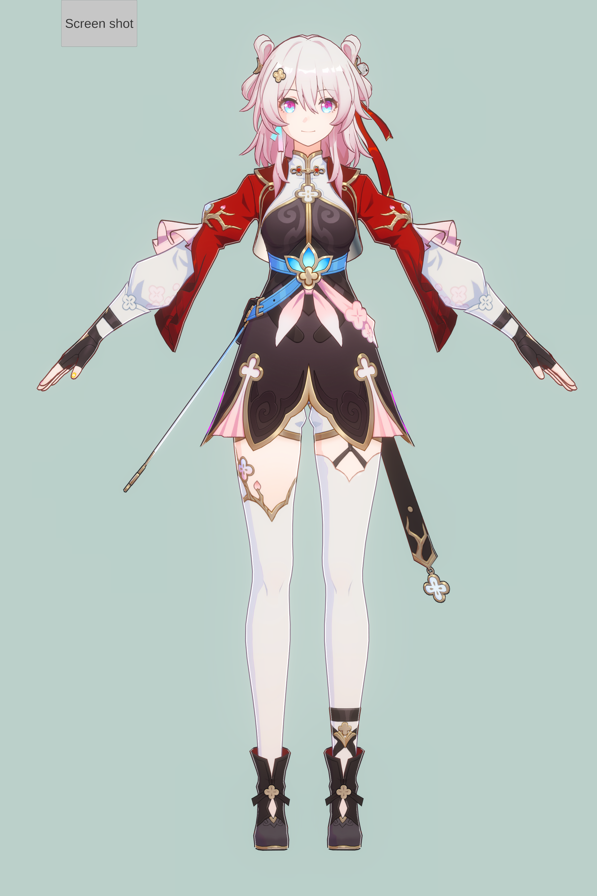
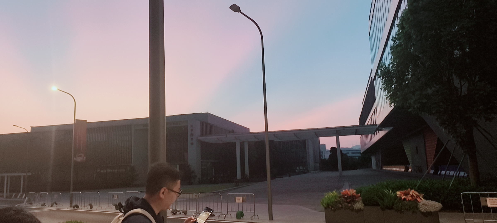
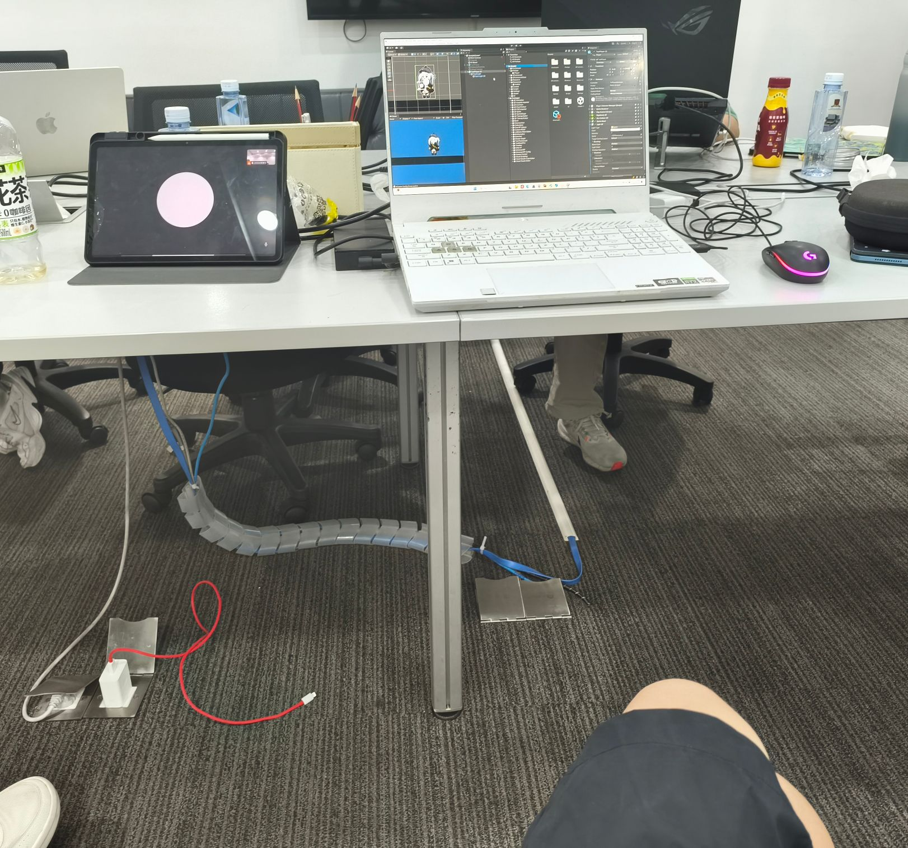
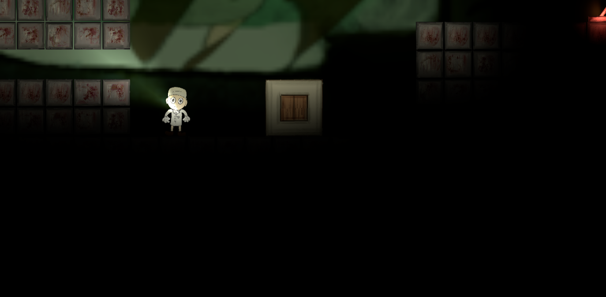
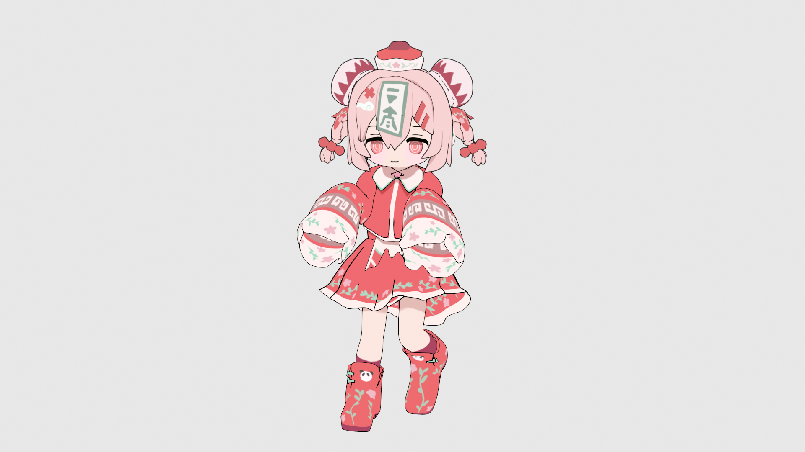
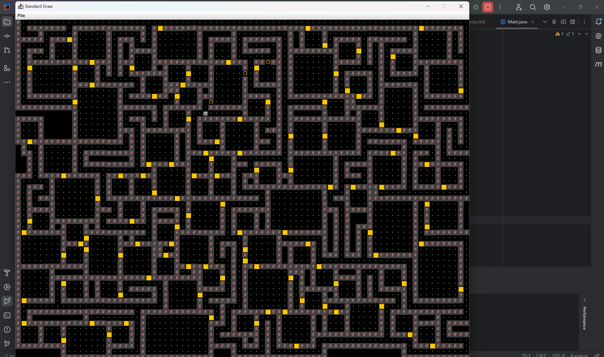
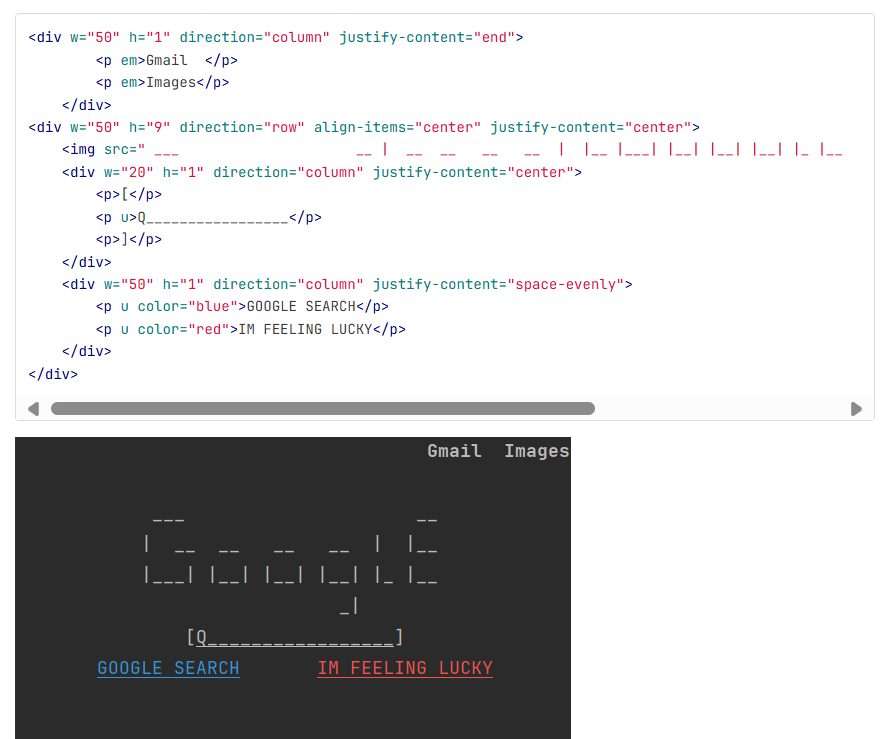
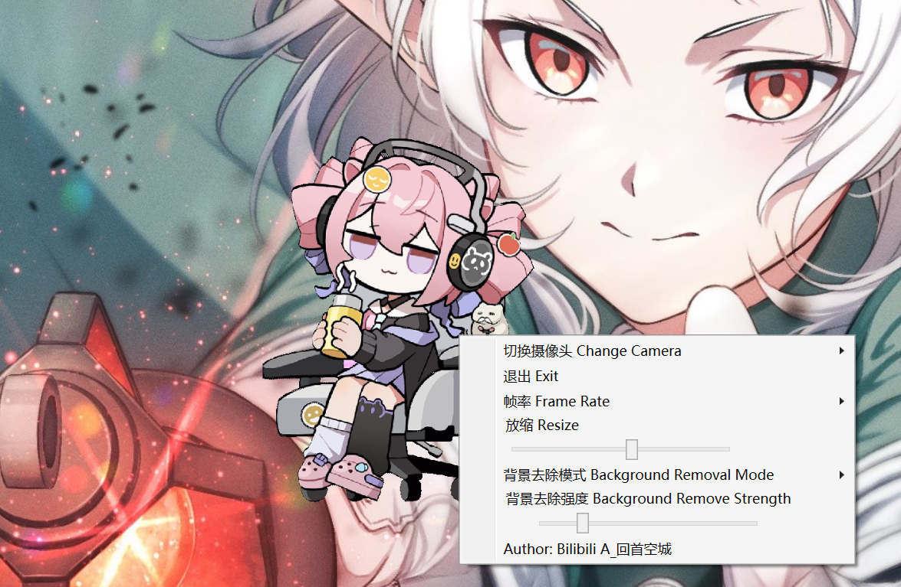

# 2024fall 学期总结

## 暑假

暑假开始学c++，在leetcode上做了一些题，同时在学games101，但实际上，由于代码能力过于欠缺，101的作业只做了前面三个。收获并不大，需要在之后重修。

八月份开始了解npr相关的东西，同时在看《Unity shader 入门精要》。学了一点HLSL。
开始用Unity URP 管线做点项目，磕磕绊绊做了几个星期，复刻了原和崩铁的渲染。

实际效果看上去还不错，但可能很难应用到具体的项目中。

## 九月

刚入学那会主要是熟悉了一下新环境，继续在leetcode上做点题，完善一下仿崩铁渲染的项目。同时，你知道的，连续玩了十几天黑神话。入坑了*终焉的莉莉*，看完了*来自深渊*，这是两部给我留下深刻印象的作品。

## 十月

国庆节跟着学校的游戏研究社团参加了ld56（72h的gamejam）。国庆假的前四天主要是继续学习了unity的其他组件，跟教程做了一个2D top-down 游戏的小demo。为几天后的gamejam准备了一个简单的对话系统。

国庆的后三天是非常紧张的gamejam。睡了两天的会议室。在最后一天，面对不敢相信能做完的工作量，熬到了十月八号凌晨六点终于做完了。第一次看到了龙大早上六点的太阳。

很累，但是实在是我不可多得的宝贵经历。第一次接触比较大型的项目，第一次用git搞团队合作开发。开发能力也得到了很大的进步。

    
     
    

    <a href = "https://ldjam.com/events/ludum-dare/56/night-at-the-8th-warehouse">
    做了一个横版2D游戏</a>
    

 
但最后的排名并不好，后来我反思得出的结论是：做的体量太大，远远超出了一个gamejam应该有点体量（初次游玩大概一个小时），倒是最终我们只能实现一堆最基本的东西，而没有实现让一个游戏变得更好玩，更有趣的部分。  

 
 
去了mihoyo的校招会，是我这个学期碰上最大的乐子  

在学校的万圣节晚会上出了希露菲叶特

转向luogu刷题了。gamejam后面的几个星期挺累的，没有做什么coding的项目。

学了学blender，建模和风格化渲染的内容。跟着*夏森轄*的演示做了一个小人。

本来还想在blender里面复刻在unity中实现的仿崩铁渲染的，但是这个安排搁置了。

## 十一月和十二月

入坑了csdiy
<https://csdiy.wiki/>
由于学校教的是java，所以我就从cs61b开始学了。说实话真的是一门很好的课。
project2 要求实现一个 mini git，是我收获最大的项目。
project3 实现了一个随机地图生成算法，以及一个小小的随机迷宫小游戏demo。也是很有意思的。

后面听说期末要考python，所以我在cs61b快学完的时候，也去把61a的lab和proj完成了。不得不说，仍然收获巨大。scheme，数据库，深入的匿名函数，函数指针，这些是在61b学不到的。
~~但是期末考试只考了一道很简单的python选择题~~

学cs61学的十分起劲啊，学完61ab后一口做气又冲向了61c。但很快遇到了很大的挑战。首先是c语言编写的project1的环境配置，搞了很久没搞成。同时我也并不喜欢这个项目，于是就嫖了南大的c语言大作业来代替。主要内容是实现一个魔改、极简的命令行html解释器。

很有趣，也很有意思的项目。感谢南大。

后面感觉自己对cs61c的学习兴趣远没有cs61ab大了，没有动力去做61c的大作业。于是在选取了部分61c的讲座听完后，我就放下了cs61c。

这段时间我开始慢慢停止刷leetcode和luogu了，原因大概是三个。一是觉得刷题远没有做项目有意思，二是感觉一直刷题无法建立我的实际工程能力，三是我逐渐放弃了学期开始希望打ACM的打算。

两个题站加起来总共刷了三百道，对我的帮助也是大的，不然学cs61的时候会遇到更多的困难。

刷题虽好，不要沉迷。

## 十二月下旬~至今

沉迷live2D，收集了b站的一堆免费皮套。~~天天对着VTS的面部摄像机挤眉弄眼。~~

后来想把live2D形象放在桌面上，做成一个类似桌宠的玩意，但是苦于没有相关的插件，没有找到一个现成的好用的方案。

然后我去学了一点点windows桌面应用开发。做了一个很小型的软件。期间最大的挑战是找不到一个能用的获取VTS虚拟摄像机的.net库。directShow虽然可以捕获到这个虚拟摄像头，但是输出不带透明度信息。

于是想办法实现了一个简单的纯色背景去除算法，简单的hack了一下，让人物身上与背景相似的小色块不会被误除。

 
开始学黑马的web课程，在这过程中也准备搭一个个人博客。本来想从零手搓，但感觉太难了，放弃了。
之后采用hugo + stack的方案来搭建博客，同时引入了live2D桌宠。最后的成果就是这个网站。

## 未来规划

继续学黑马，学《计算机网络 自顶向下方法》。补完games101的作业。学UE。

## 总结
这学期应该还是做了蛮多东西的。
~~当然是天天翘课导致的，一周下来只去上了体育课和英语课~~

但我觉得我的目标变得不明确了。学期开始时候，我觉得我以后就是搞图形了。还去找了学校的图形学教授。但是现在我已经说不出这种话了。

大一下学线代的时候（我现在已经开始第二学期的课程了），助教问我们矩阵乘法有什么意义，我回答了图形学中两个transformtion矩阵相乘的例子。助教下课问我是不是想搞图形学，我情不自禁回答了：“在学，但不会很深入。”

转变的原因主要有两个吧：一是就业压力，在当前的环境下，图形学的前辈几乎都在劝退，我实在不敢在已经很糟糕的就业环境下，选择一条更加不好就业的道路。二是对困难的畏惧，图形确实挺难的。

我似乎走上了一条更大众的道路。不过我也乐在其中，做web、wpf开发，也蛮有意思的。

我对计算机的爱好还比较广泛。前端后端想搞，unity，ue想搞，blender也想搞，也有去学houdini的想法。有的时候会觉得自己学的东西似乎有点太杂了。

应该尽快明确精进的方向。
