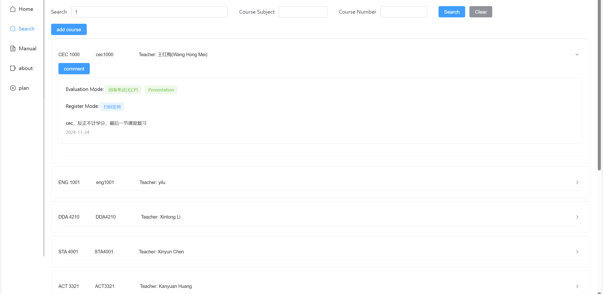

# 2025spring 学期总结 上

## 黑马

学完了java_web_ai那门公开课。还不错。学到了前后端的基本知识，也巩固了从CS61A那里学的数据库知识。

## 学校红黑榜

靠着黑马公开课的底子，给学校做了一个红黑榜单，大部分工作是我一个人做的。

技术栈是Vue+Spring+MySQL，前端还用了ElementPlus。服务器用的阿里云的99包年（确实便宜）。但是备案是不可能备案成功的了，
所以直接用的域名来传播。

学了点爬虫知识，把学校sis上的课程记录给爬了下来。

做了一个简单的邮箱登录系统。

整个过程中，AI的帮助确实是很大的。节省了非常多的时间，也从AI那里学到了很多。一个感触是：在AI时代下，我们的学习或许可以逐步从 “我会做” 变成
“我知道能这么做”。

## 在进行的

蹭上了南大jyy的计算机系统原理，正在好好听。好课。

## 学习总体

总体来说，我的课外学习时间是比上学期缩减挺多的。可能热情下降了一点吧。

## 生活

天天宅家，宅寝室。没体育课了，也彻底不会去运动了。似乎不太好。但是我确实不喜欢运动，就不强迫自己干不喜欢的事情了。

## 文化

还是蛮丰富的。

看了一些番： 《素晴》全系列、《堕落的珈百璃》。笑的很开心，喜欢惠惠。

有点喜欢上了肉鸽卡牌：重温了杀戮尖塔的崩坠，玩了三十个小时的《超时空方舟》。挺有意思。但是不能继续玩下去了。

前天周末花了一下午和晚上看完了《饿殍-明末千里行》。现在胸口依然隐隐难受。应该会是我人生中很难忘却的一部作品吧。

    
     
    

    

    满穗太可爱了，也很让人有一种保护欲。我觉得我对这种人物没有抵抗力。
    

    

走路总是想到其中的情节，也总是叹气。明末千里行是我的第一部通的AVG。这或许就是所谓玩完gal的后劲吧。
类似的体验发生在我玩完《终焉之莉莉》后，看完《来自深渊》后，看完《声之形》后。但这种感觉，虽然有点难受，但我认为也是幸福的。
是享受完一部好作品后的怅惘，失落，也是等待续作时候都急切与希冀。这也是人生的意义所在啊。

最近很急切的去补了一些明末历史和南明历史。买了顾明先生的《南明史》准备看。

好喜欢满穗。

说起莉莉，莉莉的续作木兰花其实让我失望。虽然乐在其中的玩完了，但是几乎没有留下印象深刻的情节。

## 计划
看《南明史》，今天开始学 catlike coding for unity and C#。
继续跟着jyy2025年的课程学计算机系统。

