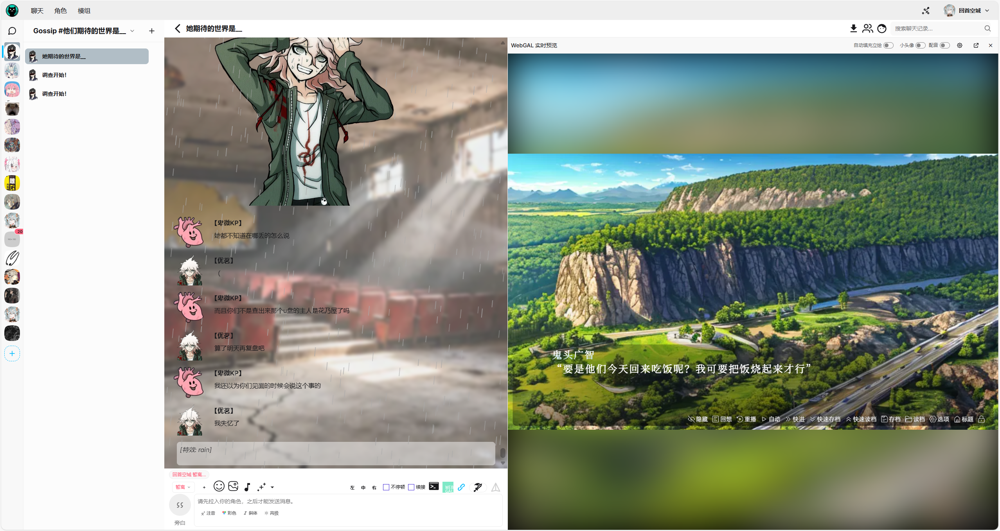
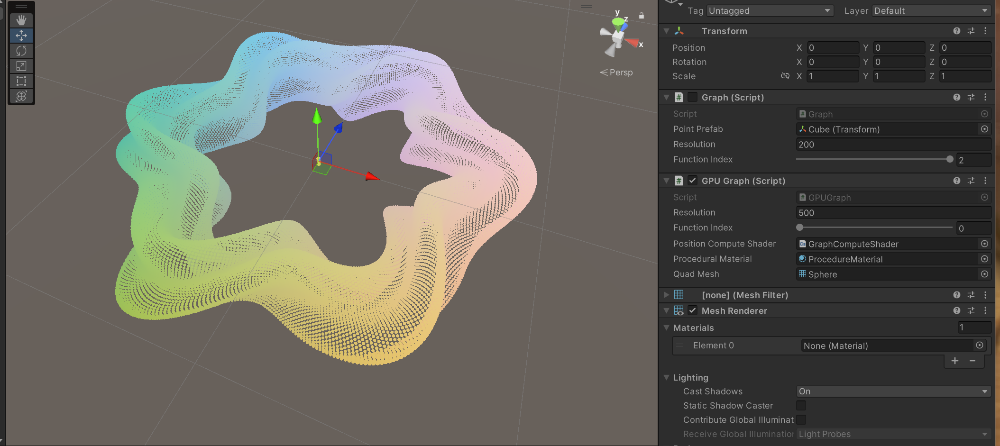
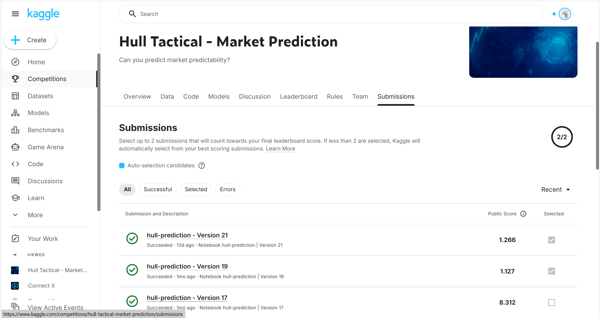
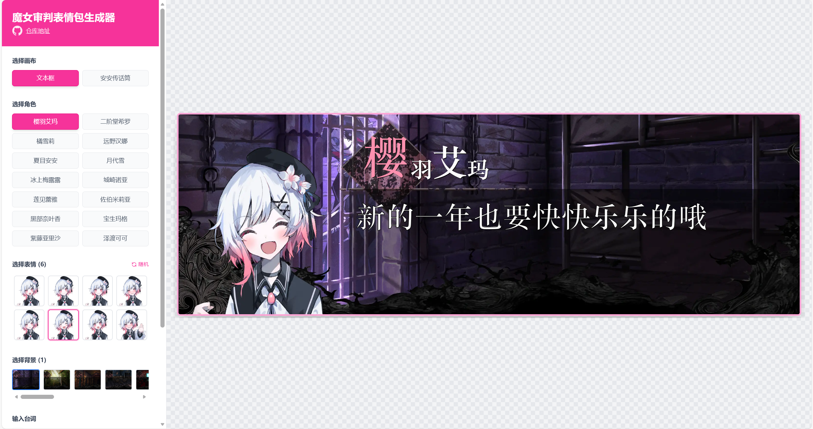
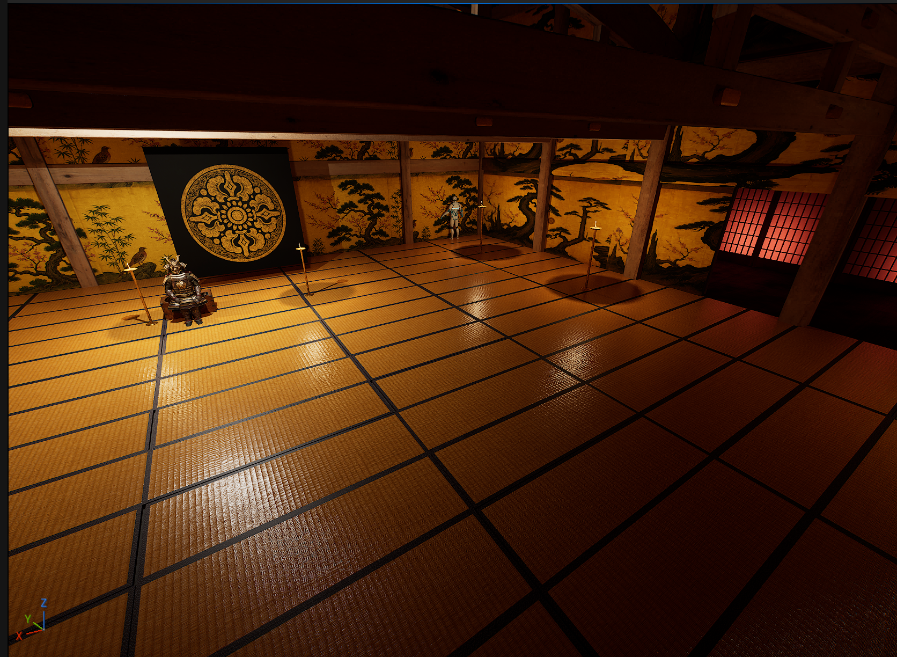
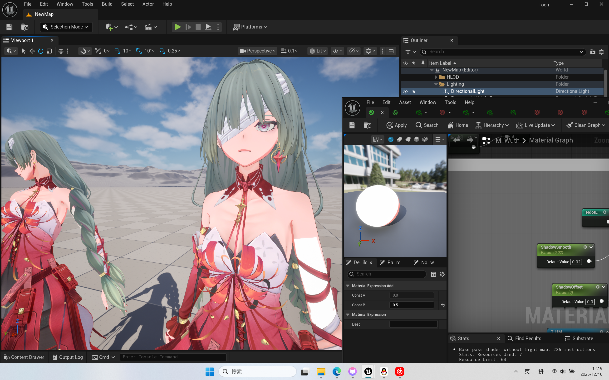

## 一月到八月
一月开始，突然觉得前端有意思，靠黑马学了一点前后端。看了java-web那个。全栈做了一个学校民间的课程红黑榜。但是现在这个项目基本废弃了。CUHKSZ虽然表面全是自由选课，但是实际限制很大，也没什么选择权，

后来四月到八月做团聚共创。

期间除了前端，顺便做了苍穹外卖和unity的 catlike coding。还看了《人月神话》，粗浅的看了看《亿级流量系统架构涉及与实践》。逐渐意识到自己并不喜欢后端。

现在看来，深入学习前端其实不是很明智的决定。为什么突然学起了前端呢，一方面是有一个在大一来说难得的实习机会，一方面是对新技术的好奇，一方面是 图形/游戏 前辈的劝退。

现在来说，前端也倒积累了一些技能。但gemini做前端真的太厉害了，总让人有一种觉得自己学得没什么用的虚无感。

## 十月到十一月
十月份打了ld58的gamejam，并不愉快。十月之后过了一段浑浑噩噩的时段。

再后面，尝试了一下机器学习，在kaggle上尝试了七八个项目

同时学了学板绘。

做了一个 魔审 的 对话框/安安写字板 网页生成器。这个时候就觉得学前端还是有点用的。

https://entropy622.github.io/web_magical_girl_witch_trials_text_box

## 最近
最近，把learn opengl做完了，相当好的教程，学的很愉快。学了除了PBR以外的部分。在手写一个基本的小渲染器外，额外写了一个toon shader，简单做了一下二分和描边。

同时搞了一段时间UE。
学了部分的Bad Decision做的UE教程。

尝试在UE里面还原了一下鸣潮的人物渲染。

## 生活

中了魔女因子。对 《魔法少女的魔女审判》（瞬间严肃） 发了很久颠。

丝之歌好玩！

MC ATM9好玩！

泰拉瑞亚灾厄好玩！

《赛博朋克2077——往日之影》：这才是真赛博朋克！

《蕾赛篇》：神作！无论是角色塑造，音乐，打戏，分镜都是无可挑剔的作品。看完一遍后立马有重看的动力。上一次能让我有这样冲动的时候还是初中看《声之形》。

## 新的一年
接着玩UE！

开心就好，干有意思的事情！

