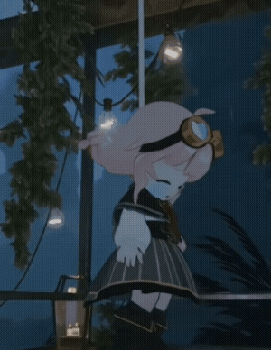
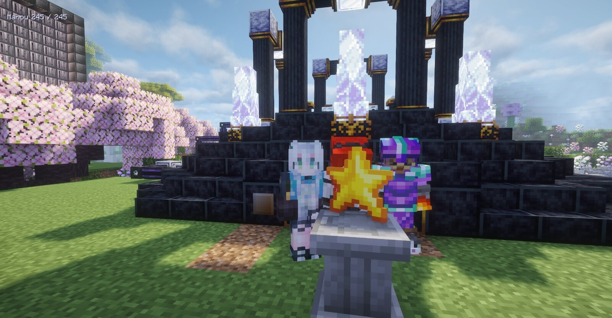
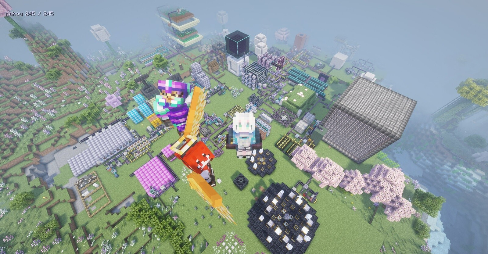
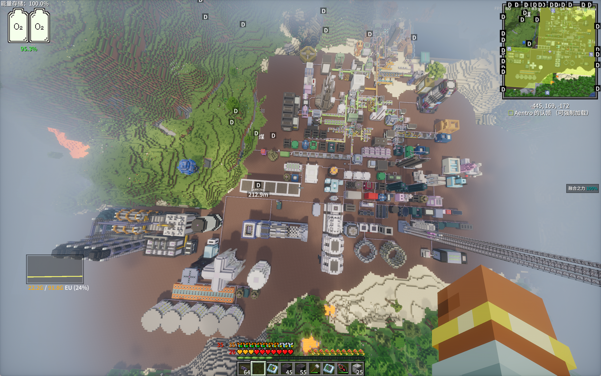
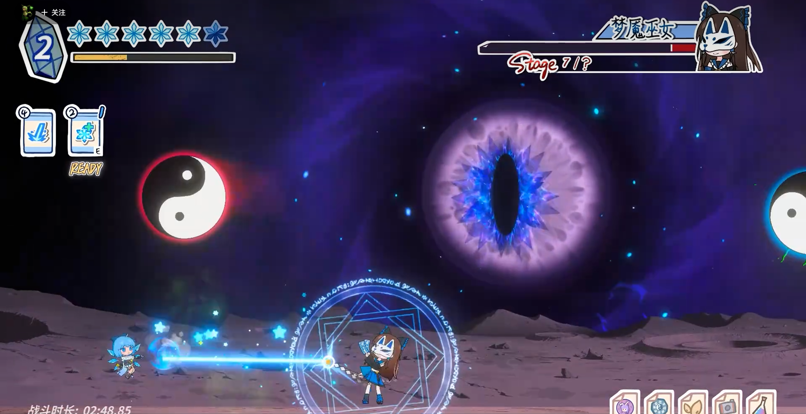

# 非生活部分
这学期基本上都在找暑期实习，累了。流水账的记一下。

一开始是朝着游戏客户端开发投的，但是意想不到的面了很多别的岗位。

## 腾讯
一开始投了光子的客户端，泡池子一个月后，被某部门的高性能组捞起来了，端侧的ai infra方向，大概是我简历上ai相关的很多吧。（投了十几家的游戏客户端，这居然是我第一次面试）

### 高性能岗

#### 一面
比较轻松。过了。面试官很友善

#### 二面
噩梦。拷打了一个半小时项目，附加上一道算法题。算法撕出来了，但是前面很多没答上来。不出意料的第二天挂了。

### 游戏客户端开发
回到池子后泡了几个星期，被光子的客户端捞起来了。

#### 一面
主要是C++八股，聊项目。算法题也手撕出来了。但是面试结尾一道送命题：
```
如果腾讯和miHoYo都过了，你会选哪边？
```

空城比较傻，说: `我要实话实说吗？`

一个星期后挂了。

## miHoYo

### 技术策划第一次

#### 一面
某部门，基本都是ai应用相关。挂

### 客户端开发

#### 笔试
算法题差半道没做出开。过了。

#### 一面
全是C++八股！（😡）

一个很基础的问题上没直接答出来。

一个星期后挂了。

### 技术策划第二次

#### 笔试
另外一个部门。到这个时候已经比较靠近暑假了。我累了。十四天的笔试做了三天草草交了上去。

几个星期后挂了。

## 字节
一开始在在seed的学长推荐下，不自量力的报了seed的agent开发。简历挂。

后来被某 To B 的部门捞起来了

### 客户端

不是游戏客户端开发。普通的移动端应用客户端开发。

#### 一面

该答的都答出来了，但是面试官说我更适合前端（确实，基本上之前的相关经历都是前端，不过我觉得web前端没什么前途了，所以不愿意继续做前端了）。流转到了同部门的前端。

### 前端

唉唉唉，最找不到挂的理由的一次。八股全答出来了，项目拷打也没什么问题。

挂了

## 鹰角

### 笔试
有点草台班子。虽然全答出来了，但是其实一开始不抱希望。最后过了，可能是六年老皱皮身份发力了。

### 一面

很轻松愉快的经历，唯一的让我觉得我在面游戏开发的面试。

但是一个多月了还什么消息都没有。

要挂就挂得痛快点！

## 总结



# 生活

## MC

### ATM10

通关！




### 航空学
非常有意思，天天看各位爱因斯坦牛顿搞发明。

### 格雷科技——新征程
沉迷两百多个小时了



佩丽卡，管理员不是不管塔卫二了，而是去格雷进修了。

咕咕嘎嘎！！！

## 东方冰之勇者记

第一次玩东方同人，也是第一次玩弹幕射击类的游戏。体验非常好。

操作上可以复用很多类银的经验，不断的凹关的过程中，能切实的体会到自身的成长。音乐很不错。

评价是：类银玩家的第一款弹幕射击游戏

### 一个印象深刻的小巧思



结尾的bgm会融合之前出场的角色的人物经历，然后boss有转阶段变身其他人的设计。但变身不是随机的，当bgm播到某个角色的部分时，boss就会变身到那个特定人物。


