这几天爽学LearnOpenGL，记录一下成果

从三角形开始的旅途

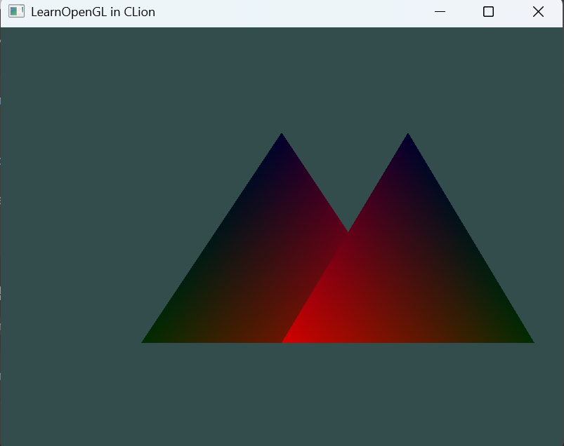

材质

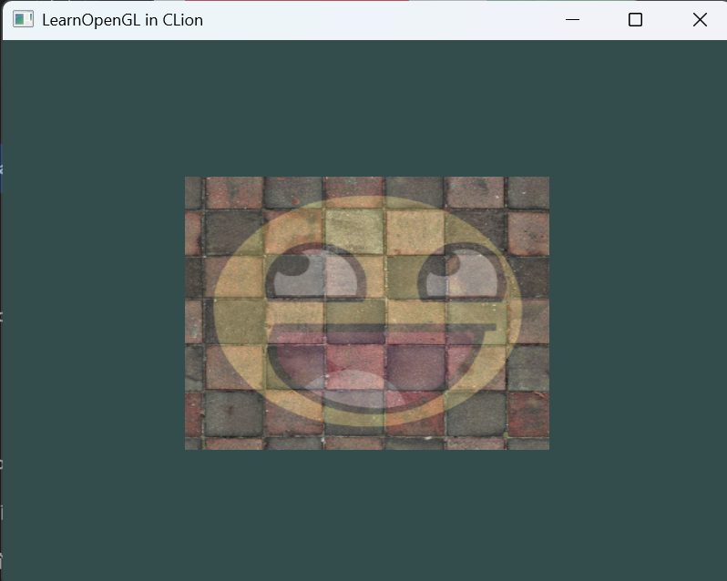

整理了一下小渲染器的工程，添加了mesh class

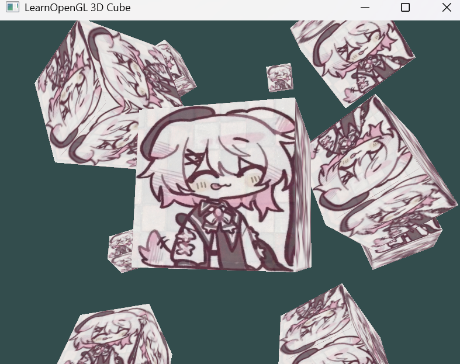

阴影

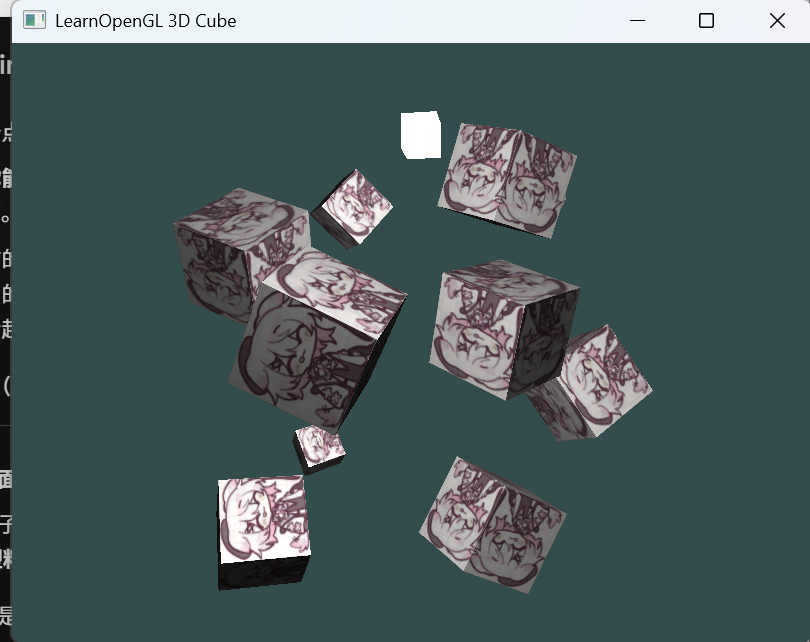

高光，自发光。高光贴图。

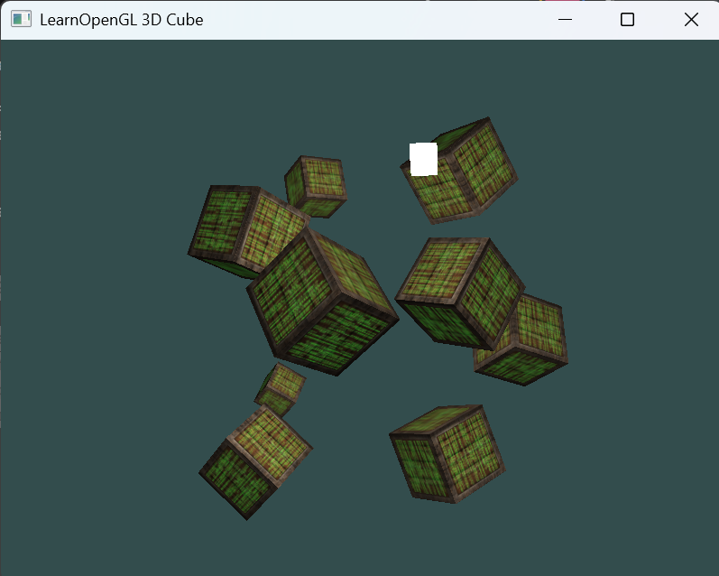

加入assimp，支持模型导入；写了一个最简单的toon shader和描边。

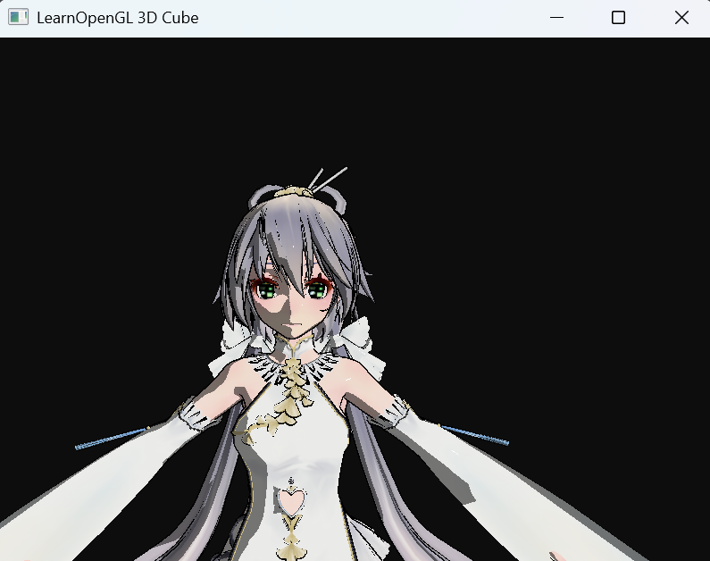

后处理（图中是边缘检测）

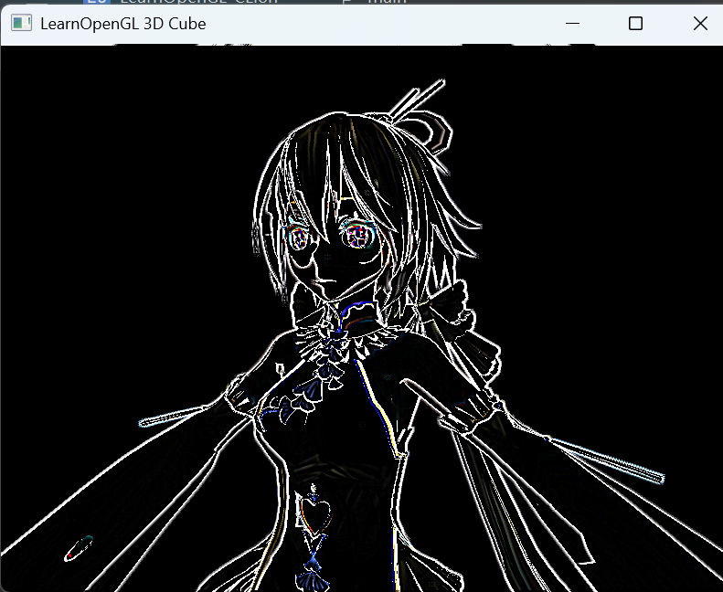

立方体贴图，天空盒；镜面材质。

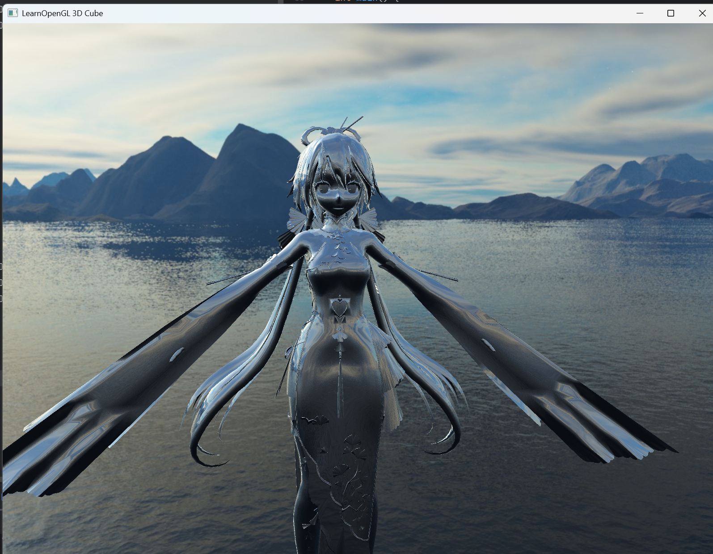

阴影映射

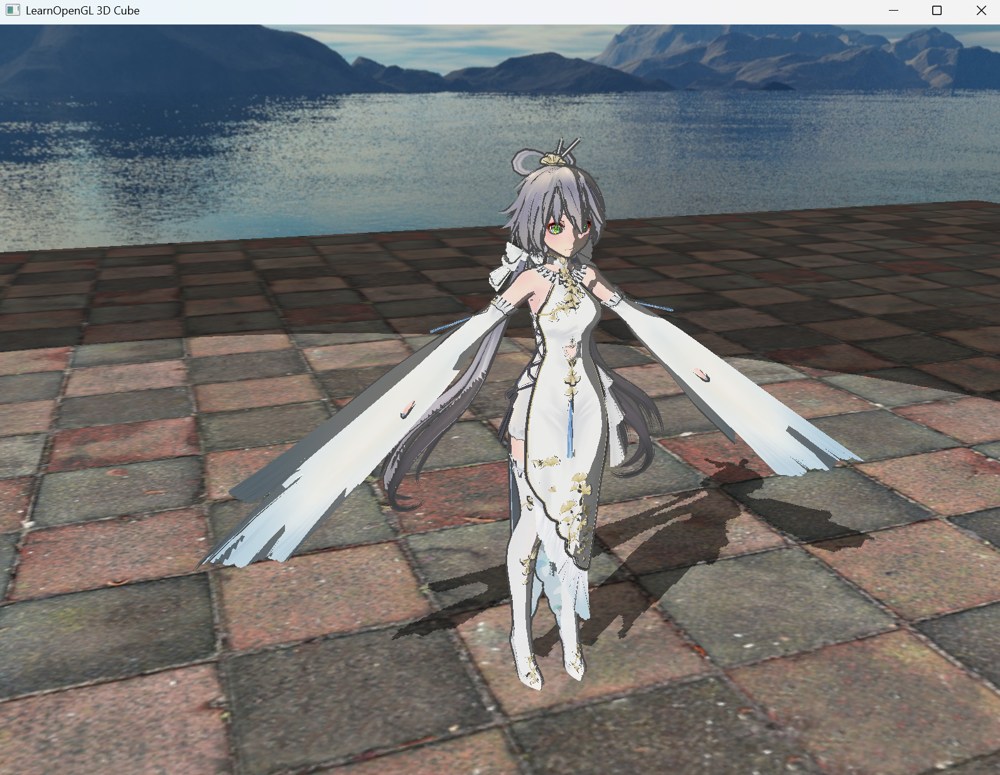
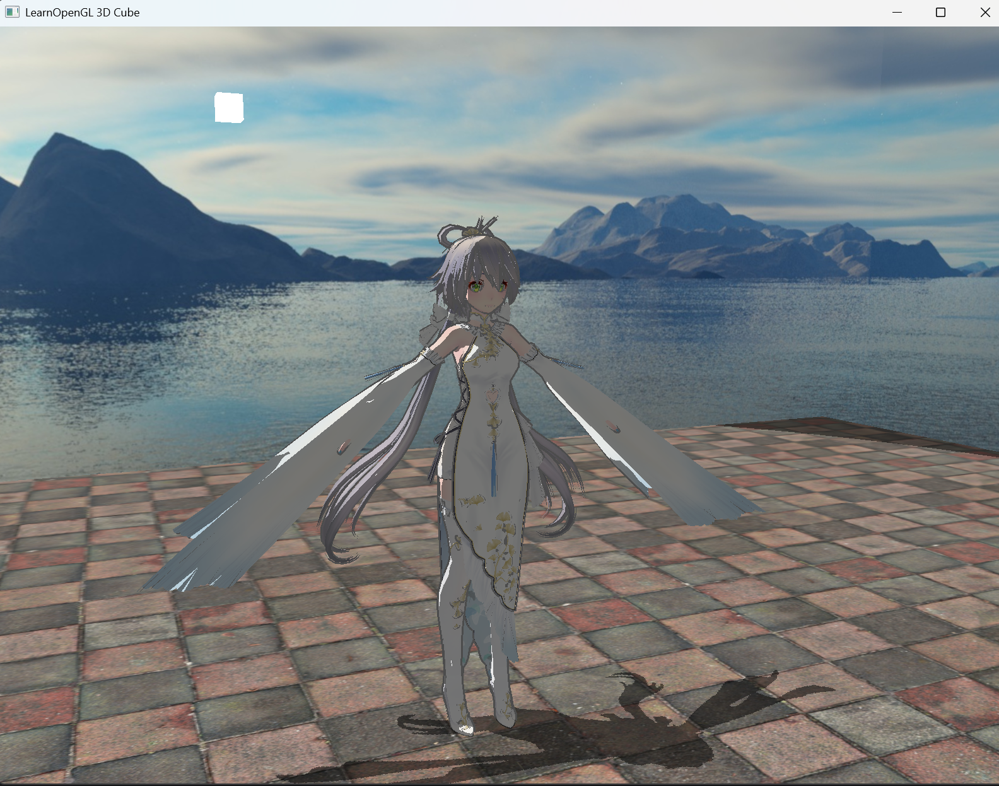

bloom。也做了hdr和伽马矫正，但是发现做了后泛白，就关了。

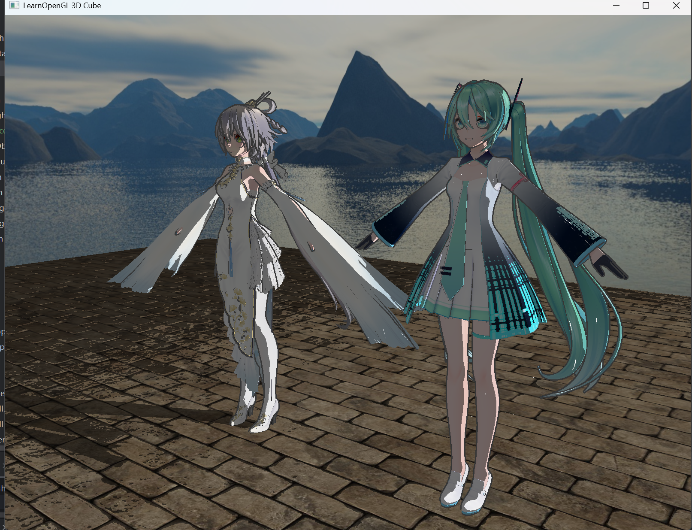

## 总结
Learn OpenGL是一个相当有意思以及实用的教程。动手真正写了一个小渲染器后才知道draw call到底是什么，显存分配到底是怎么一回事，

此外，这算是我第一个c++为主的大工程。cmake的配置很头疼，尤其是配置assimp的那一块，也算踩了必须会踩的坑。

总之，还是很有成就感的！

