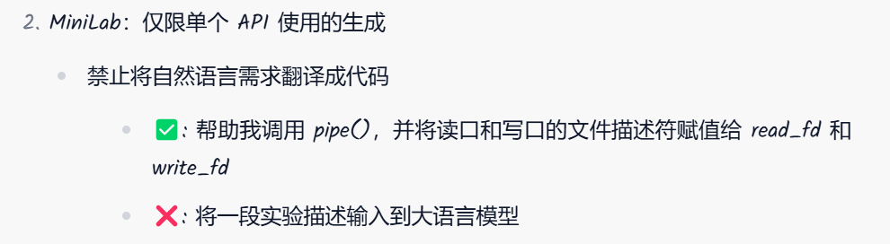

南大jyy老师在他的计算机实验课的实验须知上, 贴上了这么一段要求:

很赞同. AI对学习的帮助很大, 但是滥用也会造成不可挽回的后果. 

具体来说, 对于刚接触某一个计算机方面的初学者(比如刚学react, 刚学spring后端)来说, 
以下几个原则是建议遵守的(也是我吃过苦头或者看到别人吃苦头总结出来的, 现在时刻提醒自己的)

1. AI给你了一段代码, 绝对不要糊里糊涂的就直接粘贴上去. 一定要自己阅读, 读懂. 这个时候让AI再去给你详细的解释一下,
    也不失一个好方法.
2. 作为初学者, 做什么项目, 也绝对不要抱着让AI生成一个然后让自己满足的心态去做. 无论如何, 
    现在做项目的目的还是为了学东西.
3. 绝对不要绝对AI写了什么东西, 然后产生了自己很厉害的错觉.
4. 如果你在AI的帮助下都不能完全读懂AI给你的代码, 说明你该去看文档, 看教程. 或者直接放弃这个地方.
5. 如果在上述情况下还硬着头皮去写, 那么你之后的情况很可能是: 跑一下, 不对, 把报错粘贴给AI, 重复这个过程许多次, 
   然后你没有任何收获, 成了AI大人的CV奴隶
6. AI总是喜欢搞增量开发, 所以在AI给你debug你看不懂的代码的时候, 如果一两次搞不出来, 那么很可能AI要十几次才能从
   他陷入的逻辑中挣扎出来(这tm也真像人类). 但是不同的地方在于, 人在这种不断挣扎的过程中收获颇丰, 而你这个CV奴隶只能
   收获一堆坏心情.
7. (3的补充)不要在这种觉得你很厉害的错觉下, 去做一个你几乎不懂的项目. 这种情况下, 你基本上是会读不懂AI的代码的, 
   然后在AI给你的错觉和自信下, 你又去死磕这个项目, 最后大概就变成AI大人的CV奴隶了.
8. 在CV奴隶的状态下, 项目的开发速度常常也是极慢的, 一方面AI只会增量开发, 在开发的总代码量到一个数量级后, 你看不懂这个代码了, 
    AI由于上下文限制也不能搞懂你代码的全局了, 最后涌现出一堆AI与你都无法修复的bug, 项目进度也就变得极慢甚至停顿, 废弃.
