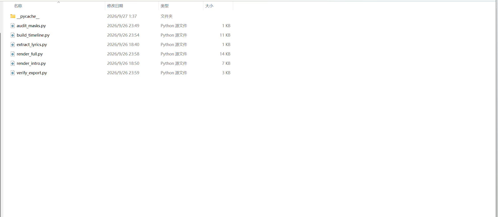
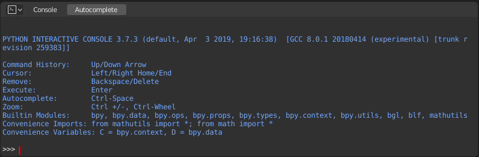
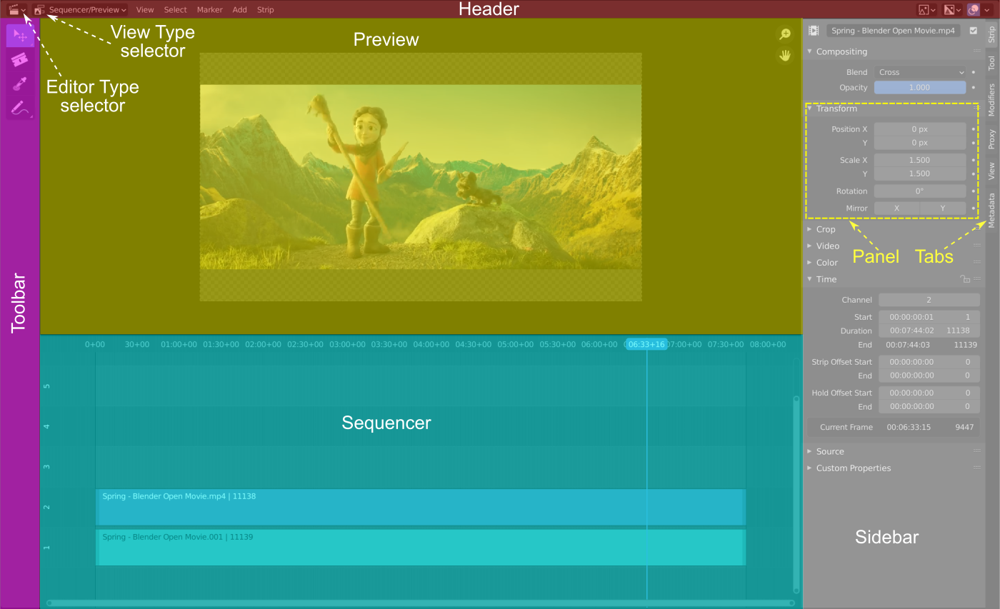

最近有个想法：现在做 agent 相关的开发，可能不一定要做一个单独的 agent。做一些适合 agent 使用的软件，比如适合 AI 操作的 PR、AE、PS，也可能是一个方向。

## 从做视频说起

前几天尝试用 GPT Astra 做了[魔术之心PV的复刻](https://www.bilibili.com/video/BV1YDaW6MEuZ/)。但制作过程中根本没用传统的剪辑软件，而是让它用 Python 写了一系列脚本。

整理时间线、渲染片头、导出视频、检查结果，都变成了代码。对 agent 来说，这套流程挺自然的：写代码，运行，看结果，再修改。

但也挺有意思的。想让 AI 做视频，最后却绕过了视频编辑器。

## 软件有没有给 AI 一个好用的入口

很多传统 DCC（数字内容创作）软件，功能很强，但操作能力主要放在 GUI 里。程序接口要么不完整，要么不好用。人点几下就能完成的事情，AI 可能只能靠 computer use 去点，慢，也容易出错。

UE 就是一个反例。大量逻辑放在蓝图里，agent 很难直接编辑；通过 MCP 能操作的范围也十分有限，基本做不了复杂蓝图逻辑。

但UE也在自救， UE6要新出的 Verse 内置脚本也是一种方案。UE在慢慢抛弃蓝图。

Blender 是一个比较好的例子。Blender Python 给 AI 操作 Blender 提供了很方便的入口。建模、改场景、设置渲染，甚至用 bpy 搭节点图，都可以写代码。**软件本身是否可编程，对 agent 能不能干活的影响很大。**

*Blender 内置的 Python 控制台。图源：[Blender 官方手册](https://docs.blender.org/manual/en/latest/editors/python_console.html)，Blender Documentation Team，[CC BY-SA 4.0](https://creativecommons.org/licenses/by-sa/4.0/)。*

## 纯脚本也不是终点

做视频这次也暴露了两个问题。

第一个是重复工作。音频裁切、时间线编辑、字幕、渲染，这些能力本来应该复用。但每次新开一个任务，agent 又要重新写一套脚本。

第二个是工程不好验收。纯脚本当然能改，但通常只能先看最终视频，再让 agent 回去改代码。想把某段往前挪一点、调一下音量，反而不如在时间线上直接拖一下方便。最后拿到的是一堆脚本和一个成片，缺少一个能接手的编辑界面。

**AI 能做出结果，和人能接着修改这个工程，是两件事。**

*时间线、预览和参数面板，让工程能被直接检查和修改。图源：[Blender 官方手册](https://docs.blender.org/manual/en/latest/editors/video_sequencer/introduction.html)，Blender Documentation Team，[CC BY-SA 4.0](https://creativecommons.org/licenses/by-sa/4.0/)；由原 SVG 转为 PNG。*

## 给 agent 做工具，也给人留一个界面

所以，可以做一个适合 AI 使用的视频编辑器。把可复用的能力做好，让 agent 通过 API、CLI 或 MCP 操作；同时保留时间线、预览和参数面板，让人能看懂工程，也能直接修改。

关键是两边操作同一个工程。agent 添加一段音频，人能在时间线上看见；人拖动一个片段，agent 下次读取工程时也能知道。工程结构最好能被读取、比较和局部修改，而不是每改一点就重新生成整个项目。

至于 agent 本身，可以接外置的。规划、上下文管理、工具调用这些东西，现成的 agent 框架已经在做，未必值得自己再手搭一套。

想做“视频编辑 agent”，也许可以先做一个 agent 真正用得顺手的视频编辑器。DCC 软件未来的一个方向，可能就是：**把软件的能力开放给 agent，把工程的控制权留给人。**
